# 👋 Hello World!, I'm Nasser

- 💼 Currently working on my own Portfolio   
- 🚧 Currently working on my own Saas  
- 🧑‍💻 Working as a web developer and 🎨 designer since 2022  

# 💻 Tech Stack :

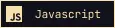

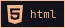
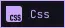

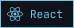
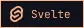
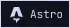

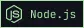

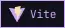
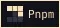

# 🧰 Tools i Use :

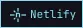
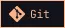

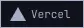

# 👩‍💻 Am currently learning :

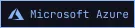
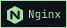

<!---
Nasserkar/Nasserkar is a ✨ special ✨ repository because its `README.md` (this file) appears on your GitHub profile.
You can click the Preview link to take a look at your changes.
--->
